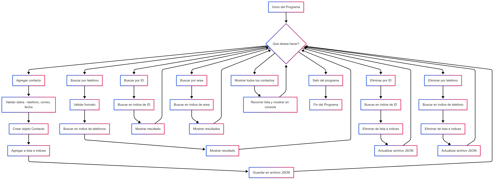

[](https://classroom.github.com/online_ide?assignment_repo_id=18698265&assignment_repo_type=AssignmentRepo)

[![Universidad ECCI][IMGECCI]][ECCIBOG]

# Lab 1.1: Directorio telefónico con clases, listas y diccionarios

Se realizaron dos codigos los cuales uno maneja un archivo ```JSON``` el cual es -> [JSON][CODJSON] y el otro un archivo ```CSV``` -> [CSV][CODCSV], los dos trabajan de una forma muy similar sus diferencias principales son sus librerias que manejan c/u y su forma de leer y escribir sus respectivo archivo donde se encuentra la informacion de los contactos.

## Integrantes
| Integrantes |
| - |
| [`Diego Lopez`][Alejo] |
| [`Daniel Ramirez`][Daniel]||
| [`Sebastian Martinez`][Sebas]||
||

[//]: # (Referencias)

[Alejo]: <https://github.com/Alejibiris>
[Daniel]: <https://github.com/D4N1EL-R4M1R3Z>
[Sebas]: <https://github.com/SebasMtz30>
[ECCIBOG]: <https://www.ecci.edu.co/bogota/>
[IMGECCI]: <https://www.ecci.edu.co/wp-content/uploads/2021/11/logo-ECCI.png>

[CODJSON]: </Codigo_JSON.py>
[CODCSV]: </Codigo_CSV.py>

## Lab 1.1: Directorio telefónico con clases, listas y diccionarios

## 1. Objetivo general:

Desarrollar un sistema de directorio telefónico utilizando programación orientada a objetos (POO) en Python. Se utilizarán clases para modelar contactos, listas para almacenarlos y diccionarios para optimizar las búsquedas. El programa debe permitir agregar, buscar, eliminar y mostrar contactos, además de incluir validaciones de datos y persistencia en archivos ```JSON``` o ```CSV```.

## 2. Objetivos de Aprendizaje:

* Comprender la estructura y el uso de clases en Python para modelar entidades.

* Aplicar listas y diccionarios para organizar y optimizar la búsqueda de información.

* Implementar verificaciones para asegurar la calidad de los datos ingresados.

* Guardar y recuperar información utilizando formatos ```JSON``` o ```CSV```.

* Crear un menú interactivo para gestionar las funcionalidades del directorio.

## 3. Requerimientos

1. Clase ```Contacto```:

    * ```Atributos```: 

        * ```id```: Identificador único del contacto.
        * ```nombre```: Nombre completo del contacto.
        * ```telefono```: Número de teléfono de 10 dígitos.
        * ```fecha_nacimiento```: Fecha de nacimiento del contacto (debe ser válido).
        * ```correo```: Correo electrónico (debe ser válido).
        * ```area```: Área dentro de una empresa o institución a la que pertenece el contacto.

    * ```Métodos```: 
        * ```__str__()```:  Devuelve una representación formateada del contacto. 

2. Clase ```Directorio```:

    * ```Atributos```:

        * ```contactos```: Lista para almacenar objetos ```Contacto```.

        * ```indice_telefonos```: Diccionario para indexar contactos por su número de teléfono.

        * ```indice_ids```: Diccionario para indexar contactos por su ID único.

        * ```indice_areas```: Diccionario para indexar contactos por área.

        * ```areas```: Área dentro de la empresa a la que pertenece el contacto (seleccionada de una lista predefinida).

    * ```Métodos```:

        * ```agregar_contacto()```:  Agrega un contacto validando los datos y guardándolo automáticamente.

        * ```agregar_area()```: Permite agregar una nueva área predefinida.

        * ```seleccionar_area()```: Permite al usuario elegir un área de una lista numerada

        * ```buscar_por_telefono()```: Busca un contacto por número de teléfono.

        * ```buscar_por_id()```: Busca un contacto por su ID único.

        * ```buscar_por_area()```: Busca contactos por área dentro de la empresa.

        * ```eliminar_contacto_id()```: Elimina un contacto usando su ID único.

        * ```eliminar_contacto_tel()```: Elimina un contacto por número de teléfono.

        * ```mostrar_contactos()```: Muestra todos los contactos ordenados alfabéticamente.

        * ```cargar_datos```: Carga los contactos desde un archivo ```JSON``` o ```csv```.

3. Validaciones:

    * ```validar_telefono()```: Verifica que el número contenga exactamente 10 dígitos.

    * ```validar_correo()```: Confirma que el correo tenga un formato correcto.

    * ```validar_fecha_nacimiento()```: Asegura que la fecha ingresada cumpla con el formato YYYY-MM-DD.

4. Persistencia de datos: Guardar y cargar los contactos en un archivo ```JSON``` o ```csv```.


## 4. Actividades

  1. Diseño de clases: Definir las clases ```Contacto``` y ```Directorio``` con sus atributos y métodos.

  2. Implementación de métodos: Implementar los métodos de la clases para gestionar los contactos.

  3. Validaciones: Implementar las funciones de validación y úsalas en el método agregar_contacto.

  4. Persistencia de datos: Implementar los métodos ```guardar_datos``` y ```cargar_datos```.

  5. Interfaz de Usuario: Crear un menú interactivo para que el usuario pueda usar el directorio.

  6. Pruebas: Probar todas las funcionalidades del programa y corregir los errores.

## Entregables

  1. Código fuente: Subir al repositorio el archivo ```Python``` con el código completo del programa.

  2. Documentación: En el respectivo ```README.md``` de **Github Classroom** escribir una documentación técnica describiendo las funcionalidades implementadas y los desafíos encontrados.


# Diagrama de FLujo


---


# 📇 Sistema de Gestión de Contactos en Python

Este proyecto permite gestionar una libreta de contactos desde la terminal, utilizando archivos JSON para almacenamiento persistente. Se pueden **agregar, buscar, eliminar y listar contactos**, con validación de datos para asegurar la integridad de la información.

---

## 🧱 Estructura General

El código está organizado en dos clases principales:

- `Contacto`: define la estructura de cada contacto (una persona).
- `Directorio`: maneja la colección de contactos y operaciones sobre ellos (como añadir, buscar o eliminar).

Además, incluye una función `menu()` que actúa como interfaz de usuario en consola.


---

## 🔹 Dependencias

Este proyecto utiliza exclusivamente módulos incluidos en la biblioteca estándar de Python, por lo que no necesitas instalar paquetes adicionales:

- **`json`**: para la lectura y escritura de archivos en formato JSON, permitiendo el almacenamiento persistente de los contactos.
- **`re`**: se usa para validar entradas como correos electrónicos y números de teléfono mediante expresiones regulares.
- **`datetime`**: permite verificar que las fechas ingresadas tengan el formato correcto (`YYYY-MM-DD`) y sean válidas.


---

## 🔸 Clase `Contacto`

La clase `Contacto` encapsula la información individual de cada persona registrada en el directorio.

### 🧱 Constructor `__init__`

El método constructor se encarga de inicializar un nuevo objeto `Contacto` con los siguientes atributos:

- `Id`: un identificador único que distingue a cada contacto.
- `nombre`: el nombre completo de la persona.
- `telefono`: un número telefónico de 10 dígitos, validado previamente.
- `fecha_nacimiento`: la fecha de nacimiento en formato `YYYY-MM-DD`.
- `correo`: una dirección de correo electrónico válida.
- `area`: el departamento o área a la que pertenece el contacto.

Cada uno de estos valores se asigna como un atributo del objeto usando `self`, que hace referencia a la instancia actual de la clase.

### 🧾 Método `__str__`

Este método especial se sobreescribe para proporcionar una salida legible y amigable al imprimir el contacto. Retorna una cadena de texto bien estructurada que muestra todos los campos del contacto con etiquetas, facilitando su lectura en consola o al hacer búsquedas.

---

¡Claro! Aquí tienes una versión mejorada, más clara y profesional, con una redacción más fluida para el README:

---

## 🔸 Clase `Directorio`

La clase `Directorio` funciona como una agenda digital que gestiona todos los contactos registrados. Es la responsable de almacenar, organizar, validar y mantener actualizados los datos, con persistencia en un archivo JSON.

### 🧠 Inicialización

En su método constructor `__init__`, se configuran las siguientes estructuras internas:

- Una **lista principal** que almacena los objetos `Contacto`.
- Tres **diccionarios auxiliares** que permiten búsquedas rápidas:
  - Por número de teléfono.
  - Por ID único.
  - Por área o departamento.
- Una **lista de áreas predefinidas**, que pueden expandirse dinámicamente si se agregan nuevas.
- Se invoca automáticamente el método `Importar_Datos()` para cargar los contactos almacenados previamente desde un archivo JSON.

### 💾 Carga y guardado de datos

- `Importar_Datos()`: intenta abrir el archivo `ContactosJSON.json`. Si existe, lee su contenido, convierte cada entrada en un objeto `Contacto` y lo añade al directorio.
- `Exportar_Datos()`: guarda los contactos actuales convirtiéndolos en diccionarios (`.__dict__`) y escribiéndolos en el archivo JSON para mantener la persistencia.

Ambos métodos aseguran que los datos estén siempre actualizados, incluso después de cerrar el programa.

### ✅ Validaciones

Para garantizar la integridad de los datos, se incluyen tres métodos estáticos que validan la entrada del usuario:

- **Teléfono**: debe contener exactamente 10 dígitos numéricos.
- **Correo electrónico**: se valida mediante una expresión regular para cumplir el formato estándar `nombre@dominio.com`.
- **Fecha de nacimiento**: se verifica que siga el formato `YYYY-MM-DD` usando la librería `datetime`.

Estas validaciones son imprescindibles para evitar errores y asegurar un formato coherente de los datos.

### ➕ Agregar contactos

El método `agregar_contacto()` realiza los siguientes pasos:

1. Verifica que los datos ingresados sean válidos.
2. Crea un nuevo objeto `Contacto` con los datos proporcionados.
3. Añade el contacto a la lista principal y actualiza los índices de búsqueda (por ID, teléfono y área).
4. Llama a `Exportar_Datos()` para guardar los cambios en el archivo JSON de forma inmediata.

Esto garantiza que cualquier nuevo contacto esté disponible para futuras búsquedas y no se pierda tras cerrar el programa.


---

### ❌ Eliminación de contactos

El sistema permite eliminar contactos registrados mediante dos métodos:

- **Eliminación por ID**: se busca el contacto utilizando su identificador único. Si se encuentra, se elimina de la lista principal y se actualizan todos los índices asociados (teléfono y área).
- **Eliminación por número de teléfono**: funciona de manera similar, usando el número como referencia para localizar y borrar el contacto correspondiente.

En ambos casos, una vez realizado el borrado, se invoca automáticamente el método de guardado para actualizar el archivo `ContactosJSON.json` y asegurar que los cambios se mantengan al cerrar el programa.

---


### 🔍 Buscar contactos

El sistema permite buscar contactos de manera eficiente usando índices:

- **Por teléfono**: devuelve el contacto correspondiente si el número está registrado.
- **Por ID**: útil cuando se conoce el identificador exacto de una persona.
- **Por área**: muestra todos los contactos que pertenecen a una misma categoría o departamento.

Esto mejora la velocidad de búsqueda y organización dentro del sistema.


## 🖥️ Menú Interactivo

El programa incluye una función `menu()` que presenta las siguientes opciones al usuario:

1. Agregar contacto.  
2. Buscar por teléfono.  
3. Buscar por ID.  
4. Buscar por área.  
5. Eliminar por ID.  
6. Eliminar por teléfono.  
7. Mostrar todos los contactos.  
8. Salir del programa.  

El menú se ejecuta en un bucle hasta que el usuario elija salir. Es una forma práctica y sencilla de interactuar con el sistema desde la terminal.

---

## 🚀 ¿Cómo ejecutar?

1. Asegúrate de tener **Python 3.7 o superior** instalado.
2. Guarda el archivo como `agenda.py` (o el nombre que prefieras).
3. Ejecuta el script desde la terminal con el siguiente comando:

```bash
python agenda.py
```

---

## 📝 Formato del archivo JSON

Los contactos se almacenan en el archivo `ContactosJSON.json`, donde cada entrada sigue esta estructura:

```json
{
  "Id": "001",
  "nombre": "Juan Pérez",
  "telefono": "5551234567",
  "fecha_nacimiento": "1990-05-20",
  "correo": "juanperez@email.com",
  "area": "Redes"
}
```

Este formato es fácilmente legible, editable y compatible con otros sistemas que trabajen con JSON.

---


