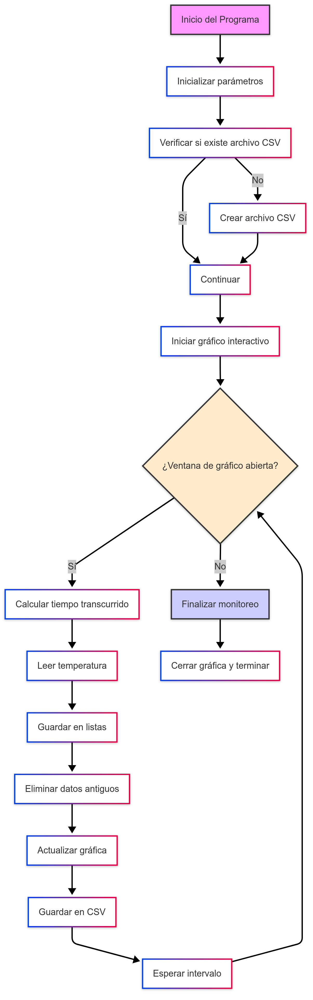

[![Universidad ECCI][IMGECCI]][ECCIBOG]

## Lab03: Visualización de Datos en Raspberry Pi Zero W

# Integrantes
| Integrantes |
| - |
| [`Diego Lopez`][Alejo] |
| [`Daniel Ramirez`][Daniel]||
| [`Sebastian Martinez`][Sebas]||
||

# Documentacion
# Diagrama de FLujo

  

# 🧪 Monitor de Temperatura en Raspberry Pi

Este programa permite monitorear en tiempo real la temperatura del procesador en una Raspberry Pi. Utiliza Python para leer, graficar y guardar datos en un archivo `.csv`.

---

## ⚙️ Funcionalidad General

El sistema realiza tres tareas principales:

- 🔍 **Lectura de temperatura** (real o simulada)  
- 📈 **Visualización en tiempo real** con gráficos dinámicos  
- 🗃️ **Registro de datos** en un archivo CSV

---

## 🧰 Componentes del Programa

### 📦 Inicialización

Cuando se ejecuta el programa:

- Se definen los parámetros:
  - `duracion_max` = tiempo que se mostrará en el gráfico (60 s por defecto)
  - `intervalo` = tiempo entre lecturas (0.5 s)
- Se inicializan las listas `tiempos` y `temperaturas` para almacenar los datos.
- Se revisa si existe el archivo CSV.  
  Si no, se crea con los encabezados:  
  `"Tiempo (s)"` y `"Temperatura (°C)"`

---

### 🌡️ Lectura de Temperatura

Existen dos modos para obtener la temperatura:

- 🧪 **Simulado**: utilizando el método `random()` generamos un número aleatorio entre 40 y 80, simulando los grados (°C) a modo de prueba.
- 🍓 **Real (opcional)**: usando el comando  `vcgencmd measure_temp` en la Raspberry Pi, iniciamos la medición de la temperatura trayendo los datos en tiempo real del sensor que esta lleva incorporado.

---

### 🔄 Actualización de Datos

En cada ciclo:

- Se calcula el tiempo transcurrido desde el inicio
- Se obtiene una nueva lectura de temperatura
- Se agregan los datos a las listas
- Se eliminan datos viejos que estén fuera del rango de tiempo mostrado

---

### 📊 Gráfica en Tiempo Real

Usando `matplotlib`, se genera un gráfico interactivo que:

- Muestra la evolución de la temperatura
- Se actualiza constantemente
- Incluye título, etiquetas y cuadrícula

Se realiza modificacion del [`Codigo`][Codigo] dado por la profesora para poder leer temperatura y/o crear numeros aletorios en el item de Temperatura y con una variable de tiempo guardar sus datos en --> [ArchivoCSV][ArchivoCSV] y a su vez graficar en tiempo real con la libreria `matplolib`.
Grafica en tiempo real por VNC.

![Grafica][Grafica]

Archivo CSV con los datos.

![DatosCSV][DatosCSV]

### 💾 Guardado en CSV

Después de cada lectura, se añade una nueva fila al archivo `datos_temperatura.csv`, manteniendo un registro ordenado.

---

## ▶️ Ejecución del Programa

Cuando se ejecuta `monitor.ejecutar()`, el sistema:

- Entra en un bucle que se repite mientras la ventana del gráfico esté abierta
- Llama a las funciones de **actualización**, **graficación** y **guardado**
- Se detiene con `Ctrl + C` o al **cerrar la ventana**

---

[//]: # (Referencias)

[Alejo]: <https://github.com/Alejibiris>
[Daniel]: <https://github.com/D4N1EL-R4M1R3Z>
[Sebas]: <https://github.com/SebasMtz30>
[ECCIBOG]: <https://www.ecci.edu.co/bogota/>
[IMGECCI]: <https://www.ecci.edu.co/wp-content/uploads/2021/11/logo-ECCI.png>
[Grafica]: </Lab03/Imagenes/Screenshot_20250414_164956_com_realvnc_viewer_android_DesktopActivity.jpg>
[ArchivoCSV]: </Lab03/datos_temperatura.csv>
[DatosCSV]: </Lab03/Imagenes/Screenshot_20250414_165321_com_realvnc_viewer_android_DesktopActivity.jpg>
[Codigo]: </Lab03/monitor_temp.py>
